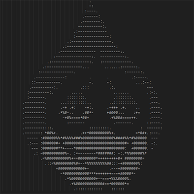

# Img2ascii
This script takes images from the folder /img and saves them as ascii art on the folder /txt

### User input:

    Image name - The name of the image to be converted. Must include extension. Ex: test.png

    Width - The width of the final image to be converted.

    Level of Detail - Increases the amount of blank spaces dedicated to darker colors. Optimal value changes from image to image.

You can check inside the /txt folder to see examples of the 3 levels of detail.

## How to use:

- Place your images in the /img folder
- Run i2a.exe
- Follow the instructions
  

## Screenshots:

### Image:

### Ascii:

